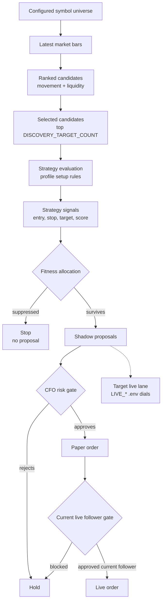
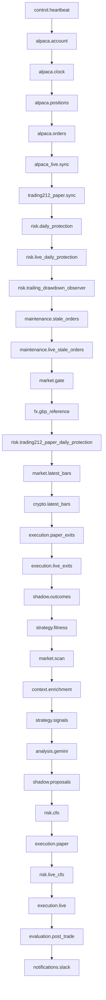

# Centaur Tick Decision Flow

This is the plain-English map for what happens when the scheduled Centaur tick
wakes up and how the system decides whether to act.

## Short Version

```text
cron/launchd tick
  -> run main.py
  -> build one TickContext
  -> run pipeline steps in order
  -> maybe manage exits
  -> maybe scan market
  -> maybe create signals
  -> maybe fitness allocation keeps or suppresses signals
  -> maybe shadow proposal is created
  -> maybe CFO risk gate approves it
  -> maybe execution submits an order
```

Centaur can do useful work without placing a new trade. A tick may update
account state, sync positions, manage exits, reap stale orders, evaluate old
shadow outcomes, update fitness, record evidence, or send alerts.

To place a new entry, the chain has to survive all the way from:

```text
candidate -> signal -> fitness allocation -> shadow proposal -> CFO approval -> order
```

The visual docs live here:

- `docs/VISUALIZATION.md`
- `docs/visuals/current_pipeline.mmd`
- `docs/visuals/current_langgraph_bridge.mmd`
- `docs/visuals/entry_decision_funnel.mmd`

## Entry Decision Funnel

This is the high-level "can this become an order?" flow:



## Where The Tick Starts

The scheduled wrapper is:

- `scripts/run_control_tick.sh`

It uses a lock so overlapping ticks skip instead of running two control loops at
once.

The Python entry point is:

- `main.py`

With no report/backfill/dashboard flag, `main.py` loads config, creates a
`ControlPipelineRunner`, and calls:

```text
runner.run_tick()
```

The runner is:

- `app/framework/runtime/control.py`

`ControlPipelineRunner.run_tick()` creates a `TickContext`, gives the tick a
timestamp id, and runs the heartbeat LangGraph. If a graph node errors, the tick
routes to `END`, stops before later gates, and records the error.

## The Default Pipeline

The human-readable start point is:

- `app/heartbeat/pipeline.py`
- `app/heartbeat/graph.py`
- `app/heartbeat/steps/NN_name/pipeline.py`

`app/heartbeat/steps/NN_name/implementation/main.py` contains the implementation
body for each heartbeat step. `app/framework/engine/pipelines.py` is now only a
compatibility facade for older imports; the heartbeat cron master pipeline owns
the runtime order so the folder tree, LangGraph, and Mermaid order stay aligned.

The entry-relevant section of the pipeline is:

```text
market.gate
fx.gbp_reference
market.latest_bars
crypto.latest_bars
execution.paper_exits
execution.live_exits
shadow.outcomes
strategy.fitness
market.scan
context.enrichment
strategy.signals
analysis.gemini
shadow.proposals
risk.cfo
execution.paper
risk.live_cfo
execution.live
```

The important thing: exits and evidence updates happen before new entries.

## LangGraph Status

The scheduled heartbeat cron now runs through the LangGraph/Pydantic graph in
`app/heartbeat/graph.py`. `app/framework/engine/control_graph.py` is a
compatibility facade for older imports.

That means:

```text
what exists today:
  explicit ordered heartbeat step pipeline folders in app/heartbeat/steps
  shared TickContext state passed from step to step
  named gates for market, strategy, fitness, risk, execution, and notifications
  LangGraph StateGraph with Pydantic graph state/node input/node output
  ControlPipelineRunner execution through run_heartbeat_cron_graph()
  graph-order parity tests against the heartbeat pipeline
  generated heartbeat LangGraph Mermaid export

what does not exist yet:
  narrow Pydantic models for each domain state slice inside TickContext
  decomposed typed domain nodes for the largest step bodies
```

New orchestration work should keep extending this typed heartbeat graph instead
of adding opaque dict-only pipeline surface.

## Visual Pipeline

This is the current pipeline shape as a Mermaid graph:

The generated source file is:

- `docs/visuals/current_pipeline.mmd`

The generated graph is intentionally code-aware: each runtime node is grouped by
an ownership lane and labelled with the source runner reference that backs it.
That keeps the visual tied to `app/` ownership instead of becoming a detached
diagram.

Regenerate it with:

```bash
.venv-mac/bin/python scripts/update_mermaid_visuals.py
```



This graph is visual documentation of the current ordered pipeline. It is not
yet generated from LangGraph.

## Do We Look At All Symbols?

No. Centaur starts from configured symbol lists. It does not ask the broker or
data provider for every tradable market on each tick.

The runtime config fields are:

```text
DISCOVERY_EQUITY_SYMBOLS
DISCOVERY_CRYPTO_SYMBOLS
DISCOVERY_TARGET_COUNT
```

The code that loads them is:

- `app/framework/runtime/settings.py`

If those environment variables are not set, Centaur falls back to built-in
defaults:

```text
equities: Nasdaq-100 style symbol universe
crypto:   BTC/USD, ETH/USD, SOL/USD, XRP/USD, DOGE/USD, LTC/USD, BCH/USD,
          LINK/USD, AVAX/USD, UNI/USD, AAVE/USD
```

In the current loaded runtime config, Centaur has:

```text
101 equity discovery symbols
11 crypto discovery symbols
DISCOVERY_TARGET_COUNT = 6
```

That means the early scan is:

```text
configured symbol universe
  -> fetch latest bars for those symbols
  -> rank them by movement/liquidity
  -> mark the top DISCOVERY_TARGET_COUNT as selected
  -> pass ranked/selected candidates into strategy evaluation
```

## Do We Ask For One Symbol At A Time?

No. Each control tick asks for the configured symbol lists as batches.

At point X in time, the tick does roughly this:

```text
if equity scanning is ready:
  ask Alpaca for latest bars for all configured equity symbols in one request

if crypto scanning is ready:
  ask Alpaca for latest bars for all configured crypto symbols in one request
```

It is not:

```text
tick 1 -> AAPL
tick 2 -> MSFT
tick 3 -> BTC/USD
```

It is closer to:

```text
tick 1:
  equities -> AAPL, MSFT, NVDA, ... all configured equity symbols
  crypto   -> BTC/USD, ETH/USD, SOL/USD, ... all configured crypto symbols

tick 2:
  repeat the same configured universe and rank the fresh bars again
```

The relevant code is:

- `app/framework/engine/pipelines.py`
- function: `market_latest_bars`
- function: `crypto_latest_bars`
- `app/framework/adapters/alpaca.py`
- function: `get_latest_bars`
- function: `get_latest_crypto_bars`

Those adapter calls build an API query like:

```text
symbols=AAPL,MSFT,NVDA,...
symbols=BTC/USD,ETH/USD,SOL/USD,...
```

After the bars come back, Centaur records them, compares each symbol to its
previous bar, computes movement/liquidity, ranks the whole set, and chooses the
top candidates for strategy evaluation.

## What Is A Symbol?

A symbol is the short market code used by a data provider or broker to refer to
an instrument.

Examples:

```text
AAPL
MSFT
BTC/USD
ETH/USD
```

For equities, the symbol is usually the ticker:

```text
AAPL = Apple stock
MSFT = Microsoft stock
```

For crypto, the symbol usually includes the traded pair:

```text
BTC/USD = Bitcoin priced in US dollars
ETH/USD = Ethereum priced in US dollars
```

## What Makes Up A Symbol In Centaur?

The simplest version is:

```text
symbol text + source/venue + asset class
```

For an equity:

```text
symbol text:  AAPL
source/venue: alpaca
asset class:  equity
meaning:      Apple stock on Alpaca's market data/broker venue
```

For crypto:

```text
symbol text:  BTC/USD
source/venue: alpaca
asset class:  crypto
meaning:      Bitcoin priced in US dollars on Alpaca
```

The symbol text itself is just a string. It only becomes properly meaningful
when Centaur also knows where it came from and what kind of instrument it is.

Centaur's configured watchlists are symbol lists:

```text
DISCOVERY_EQUITY_SYMBOLS = AAPL, MSFT, NVDA, ...
DISCOVERY_CRYPTO_SYMBOLS = BTC/USD, ETH/USD, SOL/USD, ...
```

When a latest bar is saved, Centaur carries more than just the text symbol:

```text
symbol                  = the code used in this row, such as AAPL or BTC/USD
source                  = the market-data source, such as alpaca_market_data
asset_class             = equity or crypto
venue                   = normalized venue name, such as alpaca
venue_symbol            = that venue's symbol, such as BTC/USD
canonical_instrument_id = Centaur's normalized ID, such as BTC-USD-SPOT
```

That means the symbol is the visible shorthand, but the safer identity is the
combination of symbol/source/asset class and, when available, the canonical
instrument id.

In the tick pipeline, `symbol` is the practical identifier used to fetch bars,
group candidates, avoid duplicate open positions, create shadow proposals, and
send broker orders.

There is one important wrinkle: different venues can use different symbols for
the same real-world instrument.

For example:

```text
Alpaca:   BTC/USD
Coinbase: BTC-USD
Binance:  BTCUSDT
```

Those can all refer to roughly the same underlying market, but the literal
symbol text is different. That is why Centaur also carries instrument identity
fields when it can:

```text
symbol                  = provider/broker-facing code used in this row
venue                   = where that code came from, such as alpaca
venue_symbol            = the symbol as that venue names it
canonical_instrument_id = Centaur's normalized identity for the instrument
```

The instrument identity code is:

- `app/framework/core/instruments.py`
- classes: `CanonicalInstrument`, `VenueSymbolMapping`, `InstrumentRef`

In normal reading:

```text
symbol tells you what the provider/broker called it here
canonical_instrument_id tells you what Centaur thinks the thing actually is
```

## What Is A Candidate?

A candidate is a market-data item worth looking at.

It is not a strategy decision yet. It is a ranked market snapshot produced from
the latest saved bar plus the previous bar for the same symbol/source. It is
more like:

```text
"This symbol has enough movement/liquidity/context to be worth testing against
our strategies."
```

The candidate model is:

- `app/framework/engine/candidate_engine.py`
- class: `RankedCandidate`

Important fields include:

```text
symbol
source
asset_class
rank
selected
discovery_score
close_price
previous_close_price
movement_pct
volume
trade_count
bar_timestamp
canonical_instrument_id
venue
venue_symbol
```

The ranking function is:

- `app/framework/engine/candidate_engine.py`
- function: `rank_candidates`

It calculates:

```text
movement_pct = percent move from previous close to current close
liquidity_score = log-scaled volume + log-scaled trade count
discovery_score = abs(movement_pct) * 10 + liquidity_score
```

Then it sorts by:

```text
discovery_score
absolute movement
trade count
volume
symbol
```

The top `discovery_target_count` candidates are marked:

```text
selected = true
```

The rest can still be recorded as ranked evidence, but selected candidates are
the main shortlist for later enrichment and strategy evaluation.

The scan step is:

- `app/framework/engine/pipelines.py`
- function: `market_scan`

If there are no current bars or no ranked candidates, entry generation has
nothing useful to work with.

## What Is A Signal?

A signal is not a trade.

A signal means:

```text
"One strategy sees a setup on this symbol right now, with this score,
confidence, entry, stop, target, and holding window."
```

The current price is only one ingredient in a signal.

For example:

```text
current price:
  AAPL is trading around $200

signal:
  mean_reversion.snapback thinks AAPL has pulled back enough, has enough
  liquidity, and could be worth a long test with:

  entry_price = $200
  stop_loss_price = $198
  target_price = $202.50
  signal_score = 72
  holding_window = 1h
```

So:

```text
price is market data
candidate is a ranked market snapshot
signal is a strategy's structured opinion about that data
```

The signal model is:

- `app/framework/strategies/base.py`
- class: `StrategySignal`

Important fields include:

```text
strategy_id
strategy_family
profile_id
source
symbol
asset_class
direction
signal_score
confidence
entry_price
stop_loss_price
target_price
risk_pct
target_return_pct
holding_window_code
holding_window_minutes
rationale
```

The strategy registry is:

- `app/framework/strategies/registry.py`
- function: `evaluate_strategies`

That function runs each strategy profile over the enriched candidates, collects
signals, sorts them by score/confidence, and returns a batch.

## How Does A Candidate Become Interesting Enough To Be A Signal?

Each strategy has one or more profiles. A profile says what kind of setup it is
looking for, which asset classes it accepts, how long it expects to hold, what
stop/target shape it uses, and the minimum score required before it emits a
signal.

The common pattern is:

```text
candidate comes in
  -> strategy checks instrument identity
  -> strategy checks asset class
  -> strategy checks movement / liquidity / technical context
  -> strategy checks entry price is valid
  -> strategy calculates signal_score
  -> strategy rejects it if signal_score is below profile.min_signal_score
  -> strategy builds a StrategySignal with entry, stop, target, score, confidence
```

The shared signal builder is:

- `app/framework/strategies/common.py`
- function: `build_signal`

`build_signal` takes the strategy's chosen entry price and profile settings,
then fills in:

```text
entry_price
stop_loss_price
target_price
risk_pct
target_return_pct
holding_window_code
direction = long
instrument metadata
```

Examples of "interesting enough" by strategy:

```text
mean_reversion.snapback
  wants an equity pullback deep enough to test a bounce, enough trades/liquidity,
  valid instrument identity, valid entry price, and signal_score above its floor.

momentum
  wants positive movement, enough trades/liquidity, valid identity and price,
  and signal_score above its floor.

momentum.volatility_breakout
  wants an equity breakout above the recent high, volume confirmation,
  volatility context, valid identity and price, and signal_score above its floor.

crypto_momentum.trend
  wants crypto movement strong enough but not spike-like, enough trades,
  enough GBP notional volume, acceptable spread if known, valid identity and
  price, and signal_score above its floor.
```

This is still before fitness and risk. A strategy can emit a signal, and then
fitness can suppress it, or the CFO gate can reject it later.

## How Is Everything Ranked?

There is not one single master ranking. Centaur ranks things in layers as they
move through the tick.

### 1. Candidate Ranking

Candidates are ranked by movement and liquidity.

The code is:

- `app/framework/engine/candidate_engine.py`
- function: `rank_candidates`

Each symbol gets a `discovery_score`:

```text
movement_pct = percent move from previous close to current close
liquidity_score = log-scaled volume + log-scaled trade count
discovery_score = abs(movement_pct) * 10 + liquidity_score
```

Then candidates are sorted by:

```text
1. discovery_score
2. absolute movement
3. trade_count
4. volume
5. symbol
```

The top `DISCOVERY_TARGET_COUNT` candidates are marked as selected.

### 2. Raw Strategy Signal Ranking

Each strategy profile looks at candidates and emits signals only when its own
setup rules pass.

Inside one strategy profile, matching signals are sorted by:

```text
1. signal_score
2. confidence
3. symbol
```

Then all strategy signals are combined and sorted by:

```text
1. signal_score
2. confidence
3. strategy_id
4. symbol
```

The code is:

- `app/framework/strategies/base.py`
- method: `StrategyDefinition.evaluate_profile`
- `app/framework/strategies/registry.py`
- function: `evaluate_strategies`

### 3. Fitness-Adjusted Signal Ranking

Fitness does not create signals. It adjusts or suppresses signals that already
exist.

After fitness allocation, surviving signals are sorted again by:

```text
1. adjusted signal_score
2. confidence
3. strategy_id
4. symbol
```

The code is:

- `app/framework/engine/fitness_engine.py`
- function: `allocate_strategy_signals`

This is where a signal can become:

```text
unproven
weighted
favored
suppressed
high_score_override
```

Suppressed signals stop here. They do not continue to proposal/risk/execution.

### 4. Proposal And CFO Selection

Shadow proposals are built from the ranked surviving signals.

Proposal creation sorts by:

```text
1. signal_score
2. confidence
3. strategy_id
4. symbol
```

The code is:

- `app/framework/engine/shadow.py`
- function: `build_shadow_proposals`

Then the CFO gate walks those proposals and approves only what still passes the
capital-preservation rules:

```text
paper execution enabled
kill switch off
daily protection not triggered
account trade-ready
available slots
no duplicate open symbol/order
strategy allowed
broker validation passed
market-hours rules passed
projected gain floor met
direction/notional/risk envelope valid
```

The code is:

- `app/framework/engine/pipelines.py`
- function: `risk_cfo_gate`

So the short version is:

```text
candidate rank = movement + liquidity
signal rank = strategy setup score + confidence
fitness rank = historical performance adjusts/suppresses signals
CFO selection = take surviving proposals in order, but only if risk permits
```

## Fitness Allocation

Fitness does not create a signal. It only judges signals that already exist.

The fitness allocator can mark a signal as:

```text
unproven
weighted
favored
suppressed
high_score_override
```

The fitness code is:

- `app/framework/engine/fitness_engine.py`
- function: `allocate_strategy_signals`

The pipeline step is:

- `app/framework/engine/pipelines.py`
- function: `strategy_signals`

The signal step does two fitness passes:

1. A preview pass with suppression effectively disabled, so the threshold
   adviser can see the current "fitness cliff."
2. The real pass using active thresholds. Signals suppressed here do not proceed
   to proposal/risk/execution gates.

## What Is A Shadow Proposal?

A shadow proposal is still not an order.

It is a watch/evidence row created from a surviving signal. It says:

```text
"Record this setup, with these checkpoint windows, so we can later measure what
would have happened."
```

The code is:

- `app/framework/engine/pipelines.py`
- function: `shadow_trade_proposals`
- `app/framework/engine/shadow.py`
- function: `build_shadow_proposals`

Proposal creation checks things like:

```text
shadow enabled
there are surviving strategy signals
recent duplicate/cooldown rules
minimum signal score
valid entry price
checkpoint windows
proposal limit
```

These proposals are also the pool the paper CFO gate considers.

## The Main "Should We Trade?" Gate

The paper CFO gate is the main new-entry choke point.

The code is:

- `app/framework/engine/pipelines.py`
- function: `risk_cfo_gate`

It starts from shadow proposals and decides whether any of them may become a
paper order.

It can hold because of:

```text
paper kill switch on
paper execution disabled
daily drawdown protection reached
account not trade-ready
no shadow proposals
no available slots
duplicate symbol already open or ordered
strategy not allowed
broker validation failed
market-hours rules
projected gain floor not met
direction unsupported
notional/risk envelope mismatch
```

If it approves anything, the decision becomes:

```text
submit_paper
```

Otherwise the decision remains:

```text
hold
```

## Paper Execution

Execution does not pick trades. It only submits CFO-approved order requests.

The code is:

- `app/framework/engine/pipelines.py`
- function: `execution_paper`

If there are no CFO approvals, execution is idle.

If there are approvals, execution routes the approved request through the broker
adapter and records the broker response.

## Live Lane

Current runtime: live is downstream of paper.

The live CFO gate is:

- `app/framework/engine/pipelines.py`
- function: `live_risk_cfo_gate`

Today, live only considers trades that paper both approved and actually
submitted. This is the 2026-05-29 first-live safety envelope, not the intended
end-state.

It then applies live-specific safety gates:

```text
runtime mode allows live
live enabled
live kill switch off
live credentials configured
activation acknowledgement present
live daily protection active
live account trade-ready
allowed strategy
available live slots
same-paper-follow validation
PDT guard for live equities
```

Target runtime direction as of 2026-06-04: live should be its own lane, not a
blind paper copy. The intended shape is:

```text
shared market evidence
shared strategy/signal engine
paper proposal lane -> PAPER_* .env dials -> paper CFO/risk -> paper execution
live proposal lane  -> LIVE_* .env dials  -> live CFO/risk  -> LiveRiskGuard -> live execution
```

In that target design, paper and live may independently trade, skip, reduce, or
block based on their lane dials and account/broker state. Live independence does
not mean widening risk or inventing live-only behaviour in code. It means the
live lane follows the configured `LIVE_*` `.env` values exactly and reports the
specific dial/gate that authorized or blocked each action.

Until that migration is implemented, tested, reported, and explicitly activated,
the current same-tick paper follower rule remains the live-money safety boundary.

## A Tick That Does Nothing Is Often Correct

A normal tick may end with no new entry because:

```text
market closed for equities
crypto scan unavailable
no fresh bars
no candidates
no strategy signals
fitness suppressed the signals
no shadow proposals passed threshold/cooldown
CFO rejected proposals
slots are full
kill switch or drawdown protection blocked execution
broker/account readiness failed
```

That is not necessarily a failure. In Centaur, "do nothing" is a valid
capital-preservation decision.

## Quick Code Map

```text
scripts/run_control_tick.sh
  Scheduled wrapper and skip-if-busy lock.

main.py
  CLI entry point. With no special flags, runs one control tick.

app/framework/runtime/control.py
  Creates TickContext and runs pipeline steps.

app/framework/engine/pipelines.py
  Main control-flow steps and risk/execution gates.

app/framework/strategies/base.py
  StrategyProfile and StrategySignal data models.

app/framework/strategies/registry.py
  Runs strategy profiles over candidates and returns signals.

app/framework/engine/fitness_engine.py
  Computes fitness summaries and applies fitness allocation to signals.

app/framework/engine/shadow.py
  Creates shadow proposals and scores later shadow outcomes.

app/framework/storage/usage.py
  Persists and aggregates evidence, proposals, outcomes, fitness rows, and tick
  state.
```
